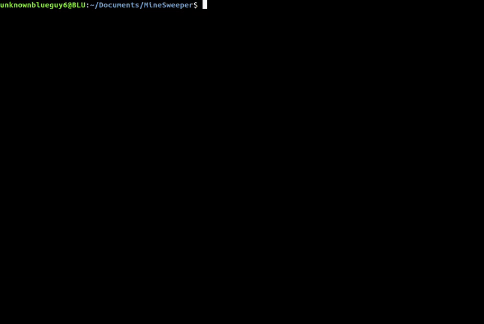

# MineSweeper
Command Line version of MineSweeper for Unix-like systems (GNU/Linux, macOS, BSD).

This is a fork, but [the original project](https://github.com/unknownblueguy6/MineSweeper) seems dead. I will gladly delete this once the changes are accepted/rejected.

<p align="center">
    </img>
</p>

## Enhancements
* AUR support (I created an AUR installer)
* Better mechanism for clearing the screen (faster, compatible with all Operating Systems)
* Improved the Makefile, with an option for the release version with optimizations enabled.


## Prerequisites
1. C++11 compiler


## Installation

1. Clone the repo.

```bash
$ git clone https://github.com/unknownblueguy6/MineSweeper.git
```

2. cd to the MineSweeper folder, and then build it using the Makefile.
   
   (Change the compiler in the Makefile, if required. Default compiler is g++)
   
```bash
$ cd MineSweeper
$ make
```

3. Run it.

```bash
$ ./mine
```

## TODO:

1. Update the gif with new controls
